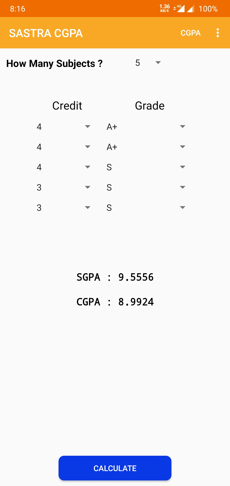
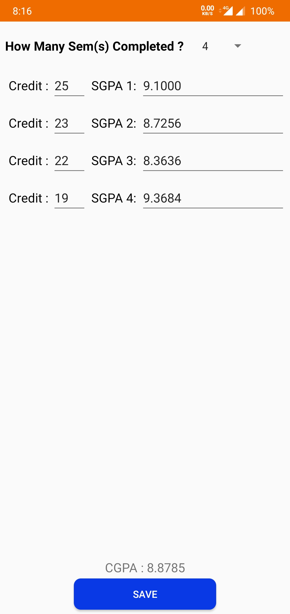
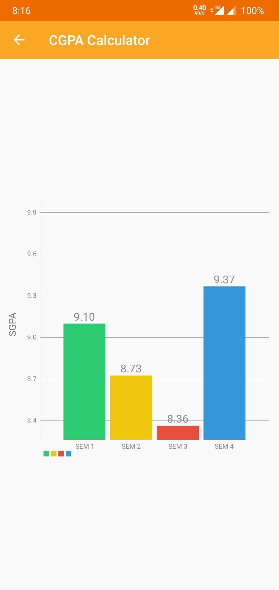
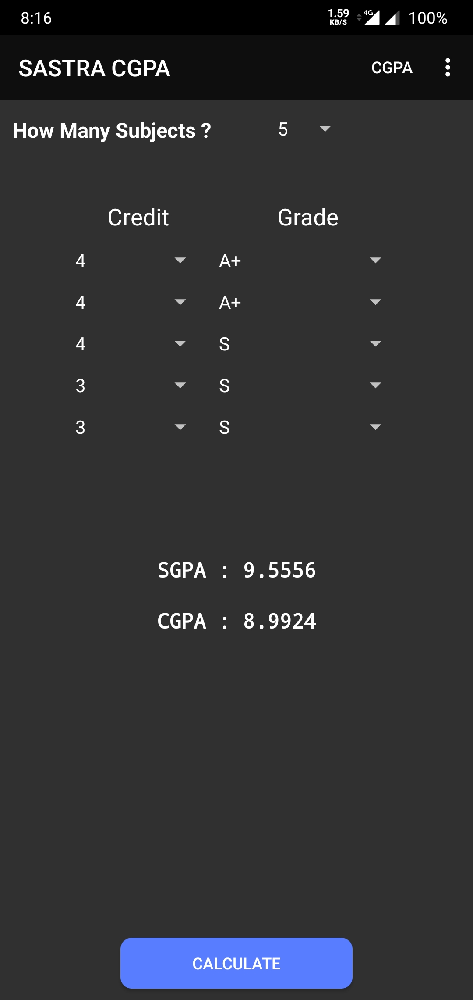
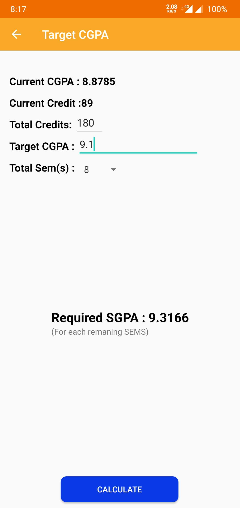
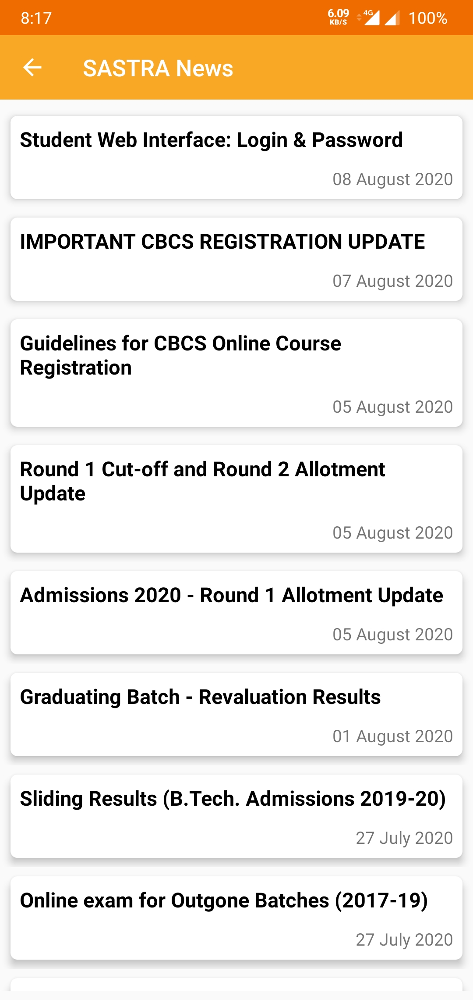

# Sastra CGPA Calculator App
A simple and interactive Sastra CGPA and SGPA Calculator App.

##  ✨Features
- [x] Calculate SGPA & CGPA.
- [x] Visualize Sem wise SGPA in Graph.
- [x] Predict required SGPA.
- [x] Sastra News Updates.
- [x] Store SGPA(s).
- [x] Dark Mode.

## ⬇Download 
Download and try the app. 
Download from Releases page [**here**](https://github.com/saif191020/SastraCGPA/releases/tag/v1.0) or from Google Drive Link [**here**](https://drive.google.com/file/d/1QU0JszIKGMIXiXApe5rSAkEQ3wa3bS-9/view?usp=sharing).

<table style="width:100%">
  <tr>
    <th>SGPA & CGPA Calculator </th>
    <th>SGPA Save Page </th>
    <th>SGPA Visualizer </th>
  </tr>
  <tr>
    <td></td> 
    <td></td>
    <td></td>
  </tr>
  <tr>
    <th>Dark Theme </th>
    <th>SGPA Predictor </th>
    <th>Sastra News </th>
  </tr>
    <tr>
    <td></td> 
    <td></td>
    <td></td>
  </tr>
</table>

## 🔌 Libraries 
| Name | Usage |
|:------:|:-------:|
|[**MPAndroidChart**](https://github.com/PhilJay/MPAndroidChart)| Used to plot the SGPA graph|
|[**JSoup**](https://jsoup.org/)| Used to get details from SASTRA website |

## 📃 License

This project is licensed under the MIT License - see the [LICENSE](LICENSE) file for details

***
> Feel free to star ⭐ this repository if you like what you see 😉.
